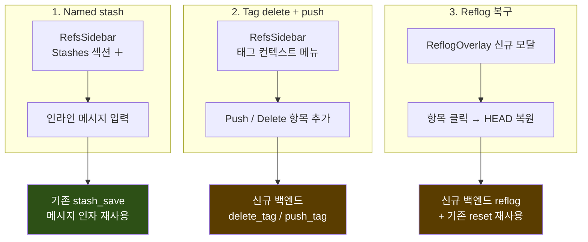
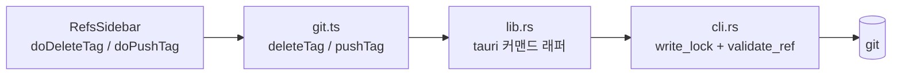
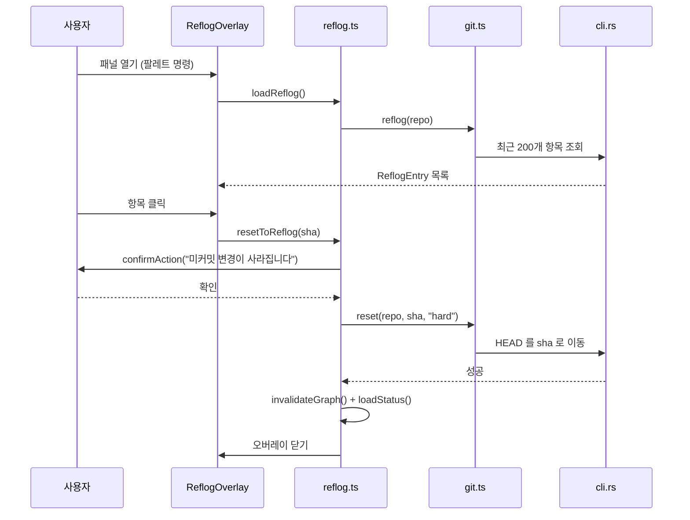
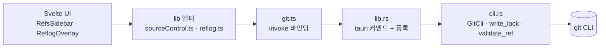

# tags · stash · reflog 설계 — 시각 설명서

> 동반 문서: [`2026-07-16-tags-stash-reflog-design.md`](./2026-07-16-tags-stash-reflog-design.md)
> 이 문서는 그 스펙을 **그림으로** 설명합니다. 결정의 근거와 정확한 요구사항은 스펙이 원본입니다.

---

## 0. 한눈에 보기



**핵심:** 신규 백엔드 커맨드는 **딱 3개**(`delete_tag`, `push_tag`, `reflog`). 나머지는 전부 기존 것 재사용.

---

## 1. 왜 이 세 가지인가 — 현재 완성도

코드를 실제로 훑어본 결과, 세 영역의 완성도가 크게 달랐습니다.

```
stash   ████████████████████░   백엔드 완비 + 사이드바 섹션 + 팔레트
                                └ 공백: 이름을 못 붙임 (UI가 message를 안 넘김)

tags    ████████████████░░░░░   목록 + Checkout + Merge + New-branch-from-here
                                └ 공백: Delete · Push 없음

reflog  ░░░░░░░░░░░░░░░░░░░░░   백엔드도 UI도 전무
                                └ 공백: 전부
```

> 그래서 이 작업은 "폴리시 3종"이 아니라 **소·중·대가 섞인 완결 작업**입니다.
> 무게중심은 reflog에 있습니다.

---

## 2. Named stash — 프론트만 고치면 끝

### 지금 무슨 일이 일어나는가

```
[＋ 버튼] ──클릭──> doStashSave()          ← 인자 없음!
                        │
                        ▼
          stashSave(path, null, true)
                        │
                        ▼
          git stash push --include-untracked   ← -m 이 안 붙음
                        │
                        ▼
              "WIP on main: 3f2a1b9 …"    ← 전부 똑같이 생김
```

`stash_save`는 **이미** 메시지를 받으면 `-m`을 붙입니다. `doStashSave(message?)`도 **이미** 인자를 받습니다.
막힌 곳은 오직 **UI가 아무것도 안 넘기는 것** 하나뿐입니다.

### 바꾼 뒤

```
   현재                                 변경 후
┌─ Stashes ─────────── ＋ ┐        ┌─ Stashes ─────────── ＋ ┐
│ WIP on main: 3f2a…      │        │ ┌─────────────────────┐ │
│ WIP on main: 8c4d…      │        │ │ 스택 메시지…        │ │ ← 인라인 입력 (신규)
│ WIP on main: 1f9e…      │        │ └─────────────────────┘ │
└─────────────────────────┘        │ 로그인 리팩터 중간 저장 │ ← 이름이 보인다
                                   │ WIP on main: 8c4d…      │ ← 빈 값이면 기존 그대로
  전부 구분 불가                    └─────────────────────────┘
```

- **Enter** → `doStashSave(msg)` · **Esc** → 취소
- **빈 값으로 제출하면 예전과 똑같이** unnamed 저장 (기존 동작 보존)
- 팔레트의 `Stash: save changes`는 그대로 **빠른 무명 저장**으로 남김 (팔레트엔 입력칸을 못 넣음)

**백엔드 변경: 0**

---

## 3. Tag delete + push — 구멍 2개만 메우기

### 태그는 이미 대부분 된다

```
RefsSidebar                       태그 우클릭 (현재)
┌────────────────┐               ┌───────────────────────┐
│ ▾ Branches     │               │ Checkout              │ ✅ 이미 됨 (detached)
│    main        │               │ Merge into current    │ ✅ 이미 됨
│ ▾ Remotes      │               │ New branch from here… │ ✅ 이미 됨
│ ▾ Tags         │ ← 이미 존재!   └───────────────────────┘
│    v1.0.0      │                   ❌ Delete 없음  (local 전용으로 막혀 있음)
│    v1.1.0      │                   ❌ Push 없음    (어디에도 없음)
│ ▾ Stashes      │
└────────────────┘
```

### 바꾼 뒤

```
태그 우클릭 (변경 후)
┌───────────────────────┐
│ Checkout              │
│ Merge into current    │
│ New branch from here… │
├───────────────────────┤
│ Push                  │ ← 신규 · origin 으로 발행
│ Delete                │ ← 신규 · 빨간색, 확인 후 삭제
└───────────────────────┘
```

### 백엔드 2개는 "이웃 복사"

기존 형제 커맨드를 그대로 본떠서 만듭니다 — 새로운 패턴을 발명하지 않습니다.

| 신규 | 본뜬 대상 | 실제 동작 | 네트워크 |
|---|---|---|---|
| `delete_tag(path, name)` | `delete_branch` | 로컬 태그 참조 제거 | ✗ 로컬 |
| `push_tag(path, name)` | `push` (origin 관례) | `refs/tags/<name>` 를 origin 에 발행 | ✓ `run_network` |



> **왜 `refs/tags/<name>` 로 명시하나?**
> 같은 이름의 브랜치가 있으면 `origin v1.0` 만으로는 어느 쪽인지 모호합니다. 명시 refspec으로 못을 박습니다.

**삭제 확인:** `confirmAction("Delete tag 'v1.0.0'?")`
→ WebView2에서 네이티브 `confirm()`은 조용히 취소되므로 **반드시** `$lib/dialogs`의 `confirmAction` 사용.

---

## 4. Reflog — 개념부터 UI까지

### 4-1. reflog가 푸는 문제

**git은 커밋을 거의 진짜로 지우지 않습니다.** 다만 *가리키는 사람이 없어질* 뿐입니다.

```
① 사고 직전
      A ── B ── C ── D ── E ── F   ← main (HEAD)
                                        커밋 6개 모두 안전

② reset --hard HEAD~3 실행
      A ── B ── C                  ← main (HEAD)
                 ╲
                  D ── E ── F      ← 아무 브랜치도 안 가리킴 = dangling
                                     객체 저장소엔 ~90일 살아있음
                                     그런데 SHA를 아무도 기억 못 함 ⚠️

③ reflog는 기억하고 있다
      HEAD@{0}  a1b2c3d  reset: moving to HEAD~3
      HEAD@{1}  f6a1b2c  commit: 로그인 버그 수정     ← F 의 SHA!
      HEAD@{2}  9a8b7c6  commit: 유효성 검사 추가

④ 그 SHA로 reset --hard → 복구 완료
      A ── B ── C ── D ── E ── F   ← main (HEAD)
```

> **한 줄 요약:** reflog는 git의 블랙박스입니다.
> "방금 뭔가 부쉈다"는 순간, **잃어버린 커밋의 SHA를 아는 유일한 장치**입니다.

### 4-2. 왜 그래프로는 안 되고 별도 패널이 필요한가

```
riff 커밋 그래프                  reflog 패널
┌────────────────┐              ┌────────────────────┐
│ C  ← main      │              │ HEAD@{0} a1b2c3d   │
│ B              │              │ HEAD@{1} f6a1b2c ★ │ ← 그래프엔 없는 커밋
│ A              │              │ HEAD@{2} 9a8b7c6 ★ │
└────────────────┘              └────────────────────┘
 ref에서 도달 가능한               HEAD가 지나온 모든 자취
 커밋만 그림                       (dangling 포함)

 ⚠️ 복구하려는 그 커밋이 애초에 그래프에 없음
```

이것이 "그래프로 점프시키자"는 대안을 버린 이유입니다 — **핵심 유즈케이스를 못 풉니다.**

### 4-3. 패널 모습

```
┌─ Reflog / Undo history ─────────────────────────────── × ┐
│                                                          │
│  HEAD@{0}  a1b2c3d  reset: moving to HEAD~3     2분 전   │
│  HEAD@{1}  f6a1b2c  commit: 로그인 버그 수정   10분 전   │ ← 클릭
│  HEAD@{2}  9a8b7c6  commit: 유효성 검사 추가   25분 전   │   = 여기로 복원
│  HEAD@{3}  4d5e6f7  checkout: moving from …     1시간 전 │
│  HEAD@{4}  7b8c9d0  rebase (finish): returning   2시간 전 │
│                                                          │
└──────────────────────────────────────────────────────────┘
     행 클릭       → 확인 → reset --hard  (파괴적, 주 동작)
     [＋ branch]  → 인라인 입력 → 그 지점에 브랜치  (비파괴 탈출구)
```

디스커버리 패스에서 만든 `CommandPalette` / `ShortcutsOverlay`와 **똑같은 모달 idiom** 재사용 (배경 클릭·Esc·포커스 처리 동일). 팔레트 명령 `Reflog / Undo history` 로 열림.

### 4-4. 복원 흐름



### 4-5. 안전 장치

```
파괴적 경로는 하나뿐 ─ 그리고 확인으로 막혀 있음

  행 클릭 ──▶ ⚠️ confirmAction ──▶ reset --hard
                    │                 └ 미커밋 변경 소실
                    └ 취소 ──▶ 아무 일 없음

  [＋ branch] ──▶ createBranch(sha)  ← HEAD 안 움직임, 100% 비파괴
```

읽기 전용인 `reflog` 조회는 `write_lock` 없이 동작 (`stash_list`와 동일).

---

## 5. 공통 호출 경로

세 기능 모두 riff의 기존 5층 구조를 그대로 탑니다.



신규 백엔드 커맨드는 4곳에 손이 갑니다: `mod.rs`(트레잇) → `cli.rs`(구현) → `lib.rs`(래퍼+등록) → `git.ts`(바인딩).

---

## 6. 파일 변경 맵

```
src-tauri/src/
  git/mod.rs        ~ delete_tag · push_tag · reflog 트레잇 시그니처
  git/cli.rs        ~ 세 구현 + parse_reflog + ReflogEntry 구조체
  lib.rs            ~ tauri 커맨드 래퍼 3개 + generate_handler 등록

src/lib/
  git.ts            ~ deleteTag · pushTag · reflog 바인딩
  types.ts          ~ ReflogEntry 인터페이스
  store.svelte.ts   ~ reflogOpen 플래그
  reflog.ts         + 신규 — loadReflog · resetToReflog
  commands.ts       ~ 팔레트 명령 "Reflog / Undo history"
  shortcuts.ts      ~ 치트시트 한 줄
  ui/
    RefsSidebar.svelte   ~ stash 인라인 입력 + 태그 Push/Delete 메뉴
    ReflogOverlay.svelte + 신규 — 모달 패널
  ../routes/
    +page.svelte    ~ 오버레이 렌더 + 모달 가드에 reflogOpen 추가

  + 신규 파일 (2)      ~ 수정 (11)
```

---

## 7. 검증 계획

```
자동 게이트 (항상 초록이어야 함)
  ├ npm test          — 순수 함수 유닛테스트
  ├ npm run check     — svelte-check 0 errors
  └ cargo check       — Rust 컴파일

수동 E2E (머지 게이트)
  ├ stash   이름 붙여 저장 → 목록에 그 이름 · 빈 값도 여전히 저장
  ├ tag     Delete → 목록에서 사라짐 · Push → origin 에 반영
  └ reflog  목록 표시 · 클릭 시 HEAD 복원 · ＋branch 는 HEAD 안 움직임
```

> **테스트 포스처(기존 관례):** git 조작과 Svelte UI는 유닛테스트하지 않고, 순수 함수만 vitest.
> reflog 파싱은 Rust에 있으므로 수동 E2E로 커버합니다.

---

## 8. 이번엔 안 하는 것

```
✗ annotated 태그 (메시지 달린 -a 태그)      → create_tag 는 lightweight 유지
✗ 원격 태그 삭제 · push --tags · origin 외 remote
✗ stash 내용 미리보기 · 부분(변경목록별) stash
✗ HEAD 외 reflog · reflog 검색/필터
✗ 나머지 Track C (원격 관리, interactive rebase, Full 팔레트)
```
